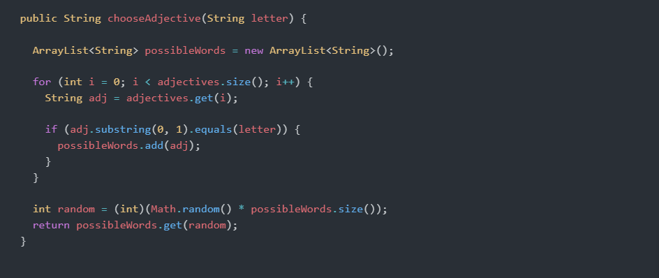

# NLP_Project

# Describe your project
Ryan is my partner.

In this project, the purpose is to create a randomized username based on the letter inputs through the console. There's a total of 5 tabs, 2 of them being text files that provide the randomized adjectives and nouns. After inputting, the user will receive their full username, along with a series of random numbers.

There are 2 classes: UserGiver and TextProcessor.

The methods found in UserGiver are chooseAdjective and chooseNoun. Both of these methods determine the possible return statements based on the letter that is submitted. For example, if a user responds with the letter "a", it will return a random adjective or noun found in the textfile. Let's say it returns "academic"; the program will ask a following question that needs the same kind of response.

This is what the output looks like:

Welcome to the User Maker! Do you want to get started? (Type anything) a

What's going to be the letter of your choice? a

You chose a. Here is a random adjective: amused

What letter again? a

You chose a. Here is a random noun: awareness

Are you ready to see your username? (Type anything) a

Here is your username together: amusedawareness4

Thank you for signing in amusedawareness4! :D

     